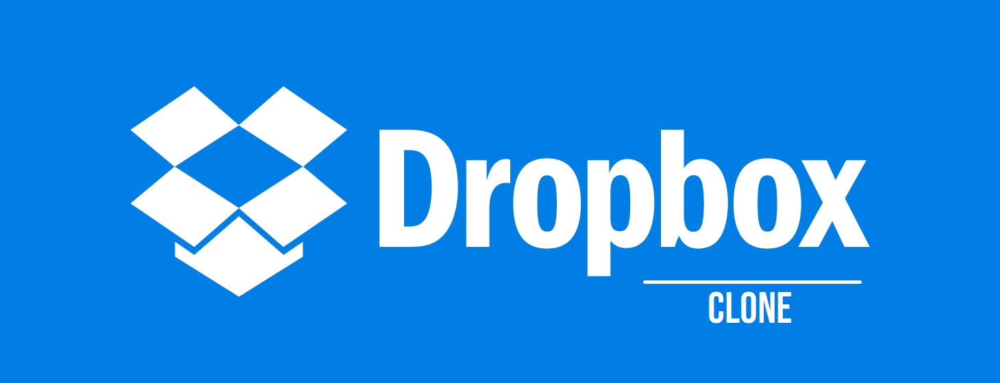
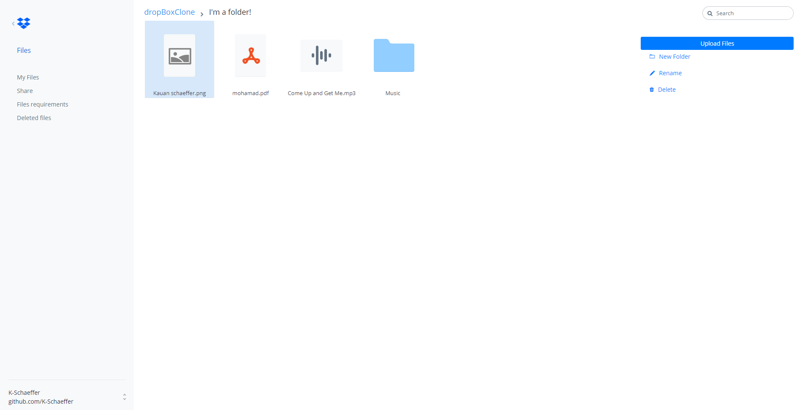
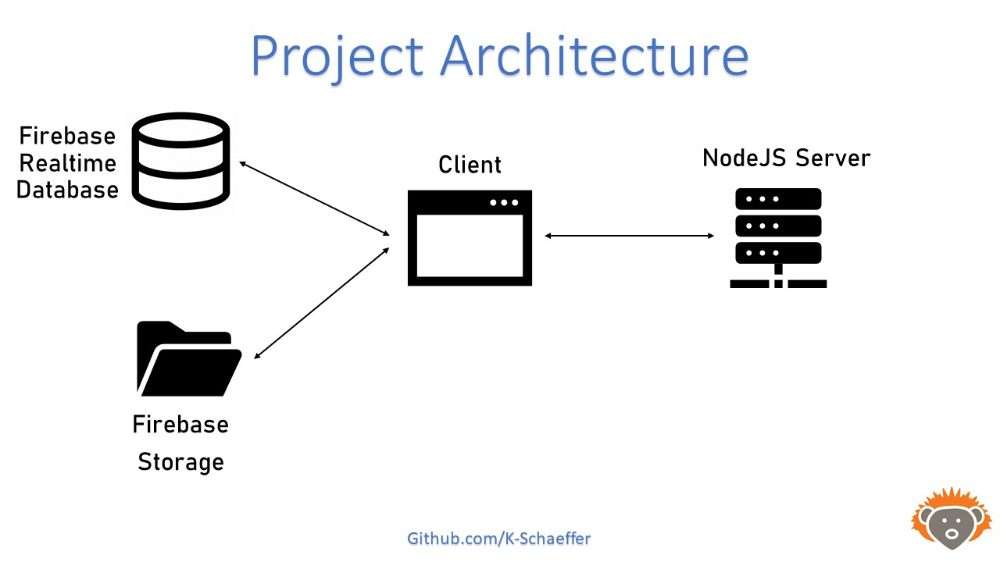

<!-- Badges session -->
<p align="center">
  
  
   

  <a href="https://github.com/K-Schaeffer/dropbox-clone-js/commits/master">
    
  </a>
  
  <a href="https://www.linkedin.com/in/k-schaeffer/">
    
  </a>
  
    
</p>

<p align="center">
    	
	<a href="">
    		
  	</a>

	
</p>

<!--Banner session-->
<h1 align="center">
    
</h1>

<!--Status session-->
<h4 align="center"> 
	🚧 Completed ✔️ 🚧
</h4>

<!-- Index session-->
<p align="center">
 <a href="#-about-the-project">About</a> •
 <a href="#-functionalities">Functionalities</a> • 
 <a href="#-layout">Layout</a> • 
 <a href="#-preview">Preview</a> • 
 <a href="#-knowledge-acquired">Knowledge acquired</a> •
 <a href="#-project-architecture">Architecture</a> • 
 <a href="#-running-the-project">Running it</a> • 
 <a href="#-technologies">Technologies</a> • 
 <a href="#-license">License</a>
</p>

<!--About session-->
## 💻 About the project

The project was developed with the guidance of a JavaScript online course. 
It was developed merely to improve my JavaScript knowledge, so all the layout, including HTML/CSS was provided by the teachers.

As a DropBox Clone, this project attempts to execute the main tasks of the software.

---

<!--Functionalities session-->
## ⚙️ Functionalities

- [x] While you navigate through the app you can:
  - [x] create folders
  - [x] navigate within folders
  - [x] upload files to the cloud
  - [x] select files (you can press ctrl and shift keys for additional actions too) 
  - [X] open flies from the cloud
  - [x] rename files in the cloud
  - [x] delete files from the cloud
  
---

<!--Layout session-->
## 🎨 Layout

<p align="center" style="display: flex; align-items: flex-start; justify-content: center;">
  
</p>

---

<!--Preview session-->
## 📺 Preview

<p align="center">
🚧 Avaliable soon 🚧
</p>

---

<!--Knowledge session-->
## 📚 Knowledge acquired

- [x] A lot of JS:
  - [x] DOM manipulation
  - [x] async requests with AJAX
  - [X] FormData
  - [X] Dataset
  - [X] events 
  - [X] promises and Promise.all 
  
- [x] NodeJS:
  - [X] routes 
  - [X] Express
  - [X] Formidable package

- [x] Firebase RTD/Storage and its methods

---

<!--Architecture session-->
## 📐 Project Architecture

<p align="center" style="display: flex; align-items: flex-start; justify-content: center;">
  
</p>

---

<!--Running session-->
## 🚀 Running the project

This project is divided in:
1. [Front-end Views](/app/views)
2. [Front-end Styles](/app/public/assets/css/dropbox-clone.css)
3. [Front-end Controller (Deal with events, and so on)](/app/public/src)
4. [Back-end](/app/app.js) 

💡 This is not a usual project structure, but, both the first and second part listed where almost untouched, as the course purpose suggests.

### Requirements

* [Git](https://git-scm.com)
* [NodeJs](https://nodejs.org/en/)
* [Bower](https://bower.io)
* [Firebase Project](https://console.firebase.google.com)


#### 🎲 Running it

```bash

# Clone this repo
$ git clone https://github.com/K-Schaeffer/dropbox-clone-js.git

# Install bower dependencies
$ bower install

# Install NPM dependencies
$ npm i

# Go to app directory
$ cd .\app\

# Run the server
$ npm start

# The project will start in the port: 3000 - open http://localhost:3000 

```

With those steps you can have the project running, but you'll **not have your own Firebase storage and Firebase realtime database linked** with your project, in order to do that:

1. Use your google account to access the [Firebase website](https://console.firebase.google.com) and create a dropbox-clone project
2. With the project created, activate the Realtime Database function, and follow their docs in order to modify the [connectFirebase()](/app/public/src/controller/DropBoxController.js) function
3. Once the realtime database is activated, activate the Storage function, and follow their docs in order to modify the [connectFirebase()](/app/public/src/controller/DropBoxController.js) function. <br>
It will have your apiKey, authDomain, **databaseURL**, **projectId**, **storageBucket**, appId and measurementId.

💡 If you don't follow those, you'll be uploading your files to my Firebase project, **that will be closed soon**.<br>
I know that I could've used a .env file to modify those properties, but at the time I developed the project I couldn't make it work properly.
Maybe it will be avaliable soon.


---

<!--Tecnologies session-->
## 🛠 Technologies

The following tools where used in the project development:

#### **Front-end**  ([HTML](https://developer.mozilla.org/pt-BR/docs/Web/HTML)  +  [CSS](https://developer.mozilla.org/pt-BR/docs/Web/CSS) + [JS](https://developer.mozilla.org/pt-BR/docs/Web/JavaScript)) + [Bower](https://bower.io)

#### **Back-end**  ([NodeJS](https://nodejs.org/en/))

-   **[Express](https://expressjs.com/)**
-   **[Formidable](https://www.npmjs.com/package/formidable)**

> See the [package.json](/app/package.json) file
#### **Useful tools**

-   Editor:  **[Visual Studio Code](https://code.visualstudio.com/)**
-   Markdown:  **[EmojiCopy](https://www.emojicopy.com)**,  **[Markdown Emoji](https://gist.github.com/rxaviers/7360908)**
-   Badges:  **[Shields.io](https://shields.io)**


<!--License session-->
## 📝 License

This project is under the [MIT](./LICENSE) license.

---

<!--Bottom session-->
<h4 align=center>Made with ❤️ by Kauan Schaeffer 👋 <a href="https://www.linkedin.com/in/k-schaeffer/">Contact me :)</a></a></h4>
